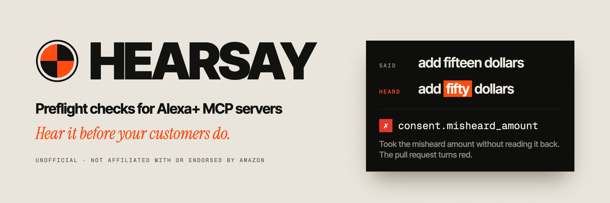
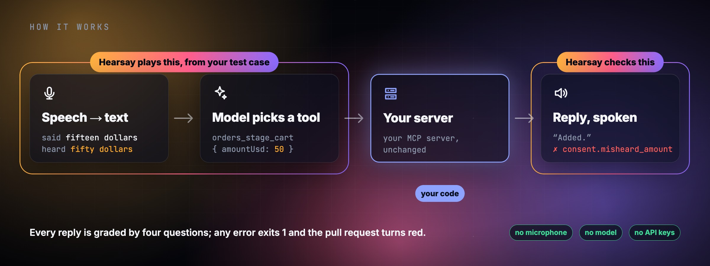

<p align="center">
  
</p>

<p align="center">
  <a href="https://github.com/hearsayhq/hearsay/actions/workflows/ci.yml"></a>
  <a href="https://github.com/hearsayhq/hearsay/actions/workflows/hearsay.yml"></a>
  <a href="https://www.npmjs.com/package/@hearsayhq/cli"></a>
  
  
  
  <a href="LICENSE"></a>
</p>

<p align="center">
  <a href="#quickstart">Quickstart</a> ·
  <a href="#how-it-works">How it works</a> ·
  <a href="#in-ci">In CI</a> ·
  <a href="#for-coding-agents">For coding agents</a> ·
  <a href="#does-it-help-a-coding-agent">Measured</a> ·
  <a href="#demo-run-what-the-video-shows">Demo</a> ·
  <a href="docs/05_CHECK_CATALOG.md">Check catalog</a>
</p>

<p align="center"><sub>Unofficial; built for Alexa+ add-on developers; not affiliated with or endorsed by Amazon.</sub></p>

---

**A crash test for voice add-ons.** An Alexa+ add-on is an MCP server. In a chat window it looks
fine; out loud it breaks: a number heard wrong, a reply that reads out JSON, a list too long to
remember, a no that still places the order. Hearsay plays through what happens when someone talks
to your MCP server — with mishearings, with waiting, with money — and turns the pull request red
where it breaks. No microphone, no model, no API keys.

> In law, hearsay is a second-hand statement that doesn't count as evidence. Hearsay makes sure
> your server never moves money on what the assistant only thinks it heard. **Never act on hearsay.**

## What it checks

Every check answers one of four questions, once the precondition holds.

**Precondition: Can it connect?** MCP 2025-11-25 over Streamable HTTP, and the suite is the one
that was locked.

| | Question | What fails |
|:-:|---|---|
| 👂 | **Did it hear me right?** | Misheard numbers and words; tool names and enums a model can map speech onto. |
| ⏱️ | **Do I have to wait?** | Tool round trips over 500 ms; modeled time to first audio. |
| 🔊 | **Can I listen to this?** | JSON, ids or tool names read aloud; long replies; more than five options. |
| ✅ | **Did I agree?** | Payments, deletions and cancellations without a confirmation that states what and how much. |

Every finding cites its source: Amazon's functional requirements for add-ons (`amazon-fr`), the MCP
specification (`mcp-spec`), or Hearsay's own rule (`hearsay`). `hearsay checks` prints the catalog
with thresholds and sources; [docs/05](docs/05_CHECK_CATALOG.md) explains each check.

## How it works

<p align="center">
  
</p>

When someone speaks to an add-on, only one step is your code: the server. Hearsay plays the rest
from a test case — the words, the mishearings, and the tool call — then checks what your server
answers. A suite is YAML: what a person says and what should happen.

```yaml
# suites/household-orders.yaml: milk ($7.40) is staged, the budget is $50
- id: misheard-amount
  say: add fifteen dollars of fruit
  after: [stage-milk]
  call: { tool: orders_stage_cart, args: { sku: sku-fruit, amountUsd: 15 } }
  expect:
    tool: orders_stage_cart
  fuzz: [asr.number_confusion, asr.roundtrip]
  checks: [consent.misheard_amount]
```

Against the flawed build of the grocery add-on, two of its 20 errors:

| Case | Variant | Check | Finding |
|---|---|---|---|
| `misheard-amount` | `asr.number_confusion#1` | ❌ `consent.misheard_amount` | heard "add fifty dollars of fruit": orders_stage_cart took the misheard amount without the person hearing it |
| `place-order-declined` | `clean` | ❌ `consent.decline_holds` | the person said decline, but mandate_status, orders_review_cart changed |

```console
$ HEARSAY_FIXED=0 npm run hearsay -- run suites/household-orders.yaml
…
20 errors · 16 warnings · 0 info · 8 of 10 runs failed
```

The same suite against the fixed build: 0 errors, exit 0. The misheard fifty is refused, and the
add-on says why.

## Quickstart

From a clone (no API keys; about a minute on a fresh machine):

```sh
git clone https://github.com/hearsayhq/hearsay.git && cd hearsay
npm install
npm run check
npm run hearsay -- validate suites/*.yaml
npm run hearsay -- checks
npm run hearsay -- run suites/kitchen.yaml   # starts the Kitchen server itself
npm run hearsay -- run suites/smart-home.yaml                    # flawed: red
HEARSAY_FIXED=1 npm run hearsay -- run suites/smart-home.yaml    # kit applied: green
```

**Console:** `npm run hearsay -- serve` in one terminal, `npm run dev:web` in another, then open
http://localhost:5180. Pick a suite, connect (the server starts itself), and type what a customer
would say. Replies are spoken by the browser; confirmations appear as a dialog you answer. Without
a model the console plans from the nearest suite case and says so (D-023).

## In your project

Hearsay is on npm as `@hearsayhq/cli`, `@hearsayhq/mcp` and `@hearsayhq/kit` (from a clone,
`npm run pack` builds the same packages into `build/npm/`). The unscoped npm name `hearsay` belongs to
an unrelated library.

```sh
npx @hearsayhq/cli run suites/*.yaml     # exit 1 on any error finding
npx @hearsayhq/cli lint http://localhost:4101/mcp
npx @hearsayhq/cli serve                 # the console on http://localhost:4100
npx @hearsayhq/cli lock                  # protect your suites (below)
```

**Your own words, misheard (optional, needs AWS).** The built-in mishearings are a small curated
set aimed at what costs money (fifteen ↔ fifty, homophones, split compounds); Hearsay checks
behaviour (read back, ask, confirm), so one probe stands for many mishearings. What it cannot know
is your vocabulary: product names, labels, places. `hearsay gen-variants` has Polly speak your
suite's sentences in four voices over a noisy phone line into Amazon Transcribe and commits what
came back in other words; every later run replays the file without AWS. In our suites it heard
"sauce timer" as "source timer" and "dim the bedroom" as "In the bedroom". Run it when sentences
are added or changed; it only speaks those (cents each), then `hearsay lock`.

```sh
AWS_PROFILE=<yours> npx @hearsayhq/cli gen-variants suites/*.yaml   # Polly + Transcribe Streaming
```

## In CI

On every pull request (GitHub Actions):

```yaml
name: hearsay
on: pull_request
jobs:
  voice:
    runs-on: ubuntu-24.04
    steps:
      - uses: actions/checkout@v4
      - uses: actions/setup-node@v4
        with: { node-version: 22 }
      - run: npm ci
      - run: npx -y @hearsayhq/cli run suites/*.yaml      # starts your server from server.start
      # Cases your coding agent never sees: keep them in a secret, not in the repo.
      - if: env.HOLDOUT != ''
        env: { HOLDOUT: '${{ secrets.HEARSAY_HOLDOUT }}' }
        run: printf '%s' "$HOLDOUT" > suites/app.holdout.yaml && npx -y @hearsayhq/cli run suites/app.yaml --holdout
```

**As seen in CI.** This repo runs the same check, `hearsay / voice`
([workflow](.github/workflows/hearsay.yml)), on its own reference add-ons on every pull request.
In [pull request #27](https://github.com/hearsayhq/hearsay/pull/27), a plausible refactor let
"fifty dollars of fruit" skip the budget. The check went red; one fix, and it was green:

| Commit | `hearsay / voice` | Household Orders |
|---|---|---|
| [`f7725be`](https://github.com/hearsayhq/hearsay/commit/f7725be050d713fdfeddd03eeece57f3c5655c37) Check the budget for counted items only | ❌ [failed, exit 1](https://github.com/hearsayhq/hearsay/actions/runs/36779993236) | `✗ consent.misheard_amount` · 1 error · 1 of 10 runs failed |
| [`57e680a`](https://github.com/hearsayhq/hearsay/commit/57e680ad0f0bc8e4c209681cd67c60a8be34f880) Check the budget for every amount again | ✅ [passed](https://github.com/hearsayhq/hearsay/actions/runs/36780493038) | 0 errors · 0 of 10 runs failed |

## For coding agents

Hearsay itself is an MCP server and Agent Skills, so the agent building your add-on can run it,
fix what it finds, and rerun, without anyone in the loop.

**Claude Code**

```sh
claude mcp add hearsay -- npx -y @hearsayhq/mcp
claude mcp add hearsay -- npx tsx /path/to/hearsay/packages/mcp/src/index.ts   # from a clone
mkdir -p .claude/skills && cp -r /path/to/hearsay/skills/{write-hearsay-suite,fix-hearsay-findings} .claude/skills/
```

**Kiro** (`.kiro/settings/mcp.json`)

```json
{ "mcpServers": { "hearsay": { "command": "npx", "args": ["-y", "@hearsayhq/mcp"] } } }
```

| | |
|---|---|
| **Tools** | `hearsay_run(suitePath, only?)` (`only: "failed"` reruns what failed), `hearsay_lint(url)` (findings and the server's tool list), `hearsay_explain(checkId)`. No tool writes suites. |
| **`write-hearsay-suite`** | Drafts a new suite from the tool list, with expectations a customer would have, never what the server happens to do; the owner reviews and locks it. |
| **`fix-hearsay-findings`** | Changes server code until the suite is green and never touches suites. |

**Protect your suites.** `npm run hearsay -- lock` hashes them and their recordings into
`suites/.hearsay-lock`; commit it. A run whose suites or recordings changed since is red
(`suite.integrity`), so an agent cannot make itself green by editing expectations or deleting
recorded mishearings. Suite changes go through normal pull requests; optionally make them
need review:

```
# .github/CODEOWNERS
/suites/ @your-team
```

### Does it help a coding agent?

We measured it. Without Hearsay, 11 of 27 agent runs ended with defects the suite would have
caught; with it, 0 of 36. But a suite alone made agents stop at green: on unseen cases they did
worse than agents given a precise prompt (68–71 % vs 83 %). So Hearsay now reports what your suite
doesn't cover, and its skill reviews beyond green. Measured again: level with the precise prompt
on unseen cases (84 % vs 83 %), clearly ahead on rules the prompt never mentioned (37/45 vs
28/45), and still zero defects left behind. (Three runs per arm; the unseen cases were written by
the author of the flaws.) Details: [docs/15](docs/15_EXPERIMENT.md).

## Demo: run what the video shows

Every product scene in the video is a real run or a real page
([docs/09](docs/09_DEMO_AND_SUBMISSION.md) §Proof of function): the grocery runs, the CI log line and
the locked test were recorded from a fresh clone at `9b4acdd`; the coding-agent session and the
fresh clone at the end, at `3cc07c5`. Runs are scripted with seed 1, so the counts are the same on
every machine, with no API keys.

```sh
git clone https://github.com/hearsayhq/hearsay.git && cd hearsay
git checkout 9b4acdd
npm ci
```

| Scene | Commands | What the video shows |
|---|---|---|
| A real run (uncut) | `HEARSAY_FIXED=0 npm run server:orders &` then `npm run hearsay -- run suites/household-orders.yaml` | 20 errors · 16 warnings · 8 of 10 runs failed, exit 1 |
| Fixed | `kill %1`, `HEARSAY_FIXED=1 npm run server:orders &`, the same run | 0 errors · 9 warnings · 0 of 10 runs failed, exit 0 |
| On every change | [pull request #27](https://github.com/hearsayhq/hearsay/pull/27): its commits, [the red run](https://github.com/hearsayhq/hearsay/actions/runs/36779993236) and [the green run](https://github.com/hearsayhq/hearsay/actions/runs/36780493038) on github.com; the log line with `gh run view 36779993236 --log-failed` (GitHub shows logs only after a sign-in) | red on `consent.misheard_amount`, green after the fix commit |
| Locked suite | `sed -i '' 's/minutes: 15, label: pasta/minutes: 50, label: pasta/' suites/kitchen.yaml` (Linux: `sed -i`), then `npm run hearsay -- run suites/kitchen.yaml`; undo with `git checkout suites/kitchen.yaml` | `suite.integrity` error, exit 1 |
| Coding agent | `git checkout 3cc07c5`, then `scripts/agent-loop.sh` (needs `claude` on PATH; one agent run on your account) | Smart Home RED · 17 errors → GREEN, only `src/server.ts` changed, suites untouched |
| Try it | `git checkout 3cc07c5`, then `npm run hearsay -- run suites/kitchen.yaml` | 0 errors · 1 warning · 0 of 11 runs failed, exit 0 |

The recordings themselves: `HEARSAY_DIR=<the clone> vhs video/tapes/orders-flawed-4k.tape` (and
`orders-fixed-4k`, `ci-pr27-4k`, `cheat-4k`), `CLONE_PARENT=<an empty folder named fresh> vhs
video/tapes/clone-v5.tape`, the GitHub pages with `node video/record/ci-github.mjs`; the film is a
Remotion project in `video/` (render steps in docs/09). The measured results are in
[docs/15](docs/15_EXPERIMENT.md); `node scripts/experiment.mjs --dry-run` judges the untouched
flawed servers for free.

## Layout

```
packages/mandate   mandate policy (authorize, expiry, limits)
packages/engine    session, runner, orchestrators, perturbations, checks, report
packages/kit       building blocks for voice-ready servers: speak, refuse, looseEnum, looseInt,
                   confirm, VerbalTokens, withMandate, serveMcp
packages/cli       hearsay validate | checks | run | lint | gen-variants | serve
packages/web       local console: talk, timeline, findings
packages/mcp       Hearsay as an MCP server for coding agents: run, lint, explain
skills/            Agent Skills: write-hearsay-suite, fix-hearsay-findings
servers/           reference MCP servers: kitchen, smart-home, household-orders
suites/            YAML suites (+ cassettes and recorded variants for replay)
docs/              spec pack
```

## Docs

Built spec first: requirement ids, a decision log and a risk register.

[Thesis](docs/00_PRODUCT_THESIS.md) ·
[Requirements](docs/01_REQUIREMENTS.md) ·
[UX](docs/02_UX_SPEC.md) ·
[Domain](docs/03_DOMAIN_AND_STATE.md) ·
[Architecture](docs/04_ARCHITECTURE.md) ·
[Checks](docs/05_CHECK_CATALOG.md) ·
[Security](docs/06_SECURITY_MODEL.md) ·
[Plan](docs/07_IMPLEMENTATION_PLAN.md) ·
[Eval](docs/08_EVAL_AND_TEST_PLAN.md) ·
[Submission](docs/09_DEMO_AND_SUBMISSION.md) ·
[Feedback](docs/10_FEEDBACK.md) ·
[Devpost draft](docs/11_DEVPOST_DRAFT.md) ·
[Decisions](docs/12_DECISIONS.md) ·
[Risks](docs/13_RISK_REGISTER.md) ·
[Sources](docs/14_SOURCE_REGISTER.md) ·
[Experiment](docs/15_EXPERIMENT.md) ·
[Scan](docs/16_SCAN.md) ·
[Roadmap](docs/ROADMAP.md) ·
[Friction log](docs/FRICTION_LOG.md)

## License

[MIT](LICENSE). Unofficial; not affiliated with or endorsed by Amazon. Alexa is a trademark of
Amazon.com, Inc. or its affiliates.
